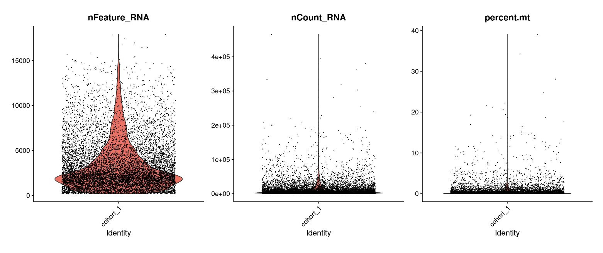

# Quality control and doublet removal
These individual samples from publicly available datasets were re-analyzed with Seurat (version 5.1.0) in R v4.3.1. Individual objects were created considering genes expressed in more than 3 cells, and cells with more than 200 genes expressed. Low-quality barcodes (nucleus) had less than 200 features or than 500 UMIs were excluded. Additionally, Mitochondrial content thresholds for exclusion were set at 5% (hypothalamus, adipose tissue and liver) and 10% (skeletal muscle). All samples were assessed for potential doublets using scDblFinder (version 1.16.0), and nucleus called as doublets were removed before further analyses.

```{r setup, include=FALSE, echo=FALSE}
knitr::opts_chunk$set(echo = TRUE)
set.seed(2024)
```

## Library necessary packages
```{shell}
library(Seurat)
library(dplyr)
library(patchwork)
library(purrr)
library(tidyverse)
library(rtracklayer)
library(Matrix)
library(scDblFinder)
```

Loading output count matrix from CellBender
```{shell}
source('./data/DemoSingle/ReadCB_h5.R')
cohort_1.data <- ReadCB_h5("./data/DemoSingle/Cohort_1_filtered.h5")
```


The Read10X() function reads the output from the Cellranger pipeline by 10X Genomics, returning a unique molecular identifier (UMI) count matrix. In this matrix, the values represent the number of detected molecules for each feature (e.g., gene, row) in each cell (column). Note that while CellBender outputs are also in .h5 format, the Read10X_h5() function in Seurat is not compatible with CellBender (version 0.3.0). Therefore, we provide the custom ReadCB_h5 function below to handle this problem.

## Setup the Seurat object
```{shell}
# Initialize the Seurat object with the raw (non-normalized data)
cohort_1 <- CreateSeuratObject(counts = cohort_1.data, 
                               project = "cohort_1", 
                               min.cells = 3, 
                               min.features = 200)
cohort_1

# Add 'percent.mt' column to object metadata
cohort_1[["percent.mt"]] <- PercentageFeatureSet(cohort_1, pattern = "^MT-")
```

## Dection and handling of doublets/multiplets
If you do not have the package, you may install the package using:
```{shell}
BiocManager::install("scDblFinder")
```

Given an object sce of class SingleCellExperiment (which has already had empty drops removed but hasn't undergone further filtering), you can initiate doublet detection with the following command:
```{shell}
sce <- as.SingleCellExperiment(cohort_1)
sce <- scDblFinder(sce)

doublets <- as.data.frame(sce$scDblFinder.class)
rownames(doublets) <- colnames(sce)
colnames(doublets) <- 'type'
cohort_1@meta.data$doublet_type <- doublets$type
```
If you want to use other methods implemented in scDblFinder, you can refer to the vignette:
https://github.com/plger/scDblFinder


## Quality control and selecting cells for further analysis
In this example, we visualize QC metrics, and use these to filter cells.

1.We filter cells that have unique counts over 200,000 or less than 500

2.We filter cells that have unique feature over 15,000 or less than 200

3.We filter cells that have >5% mitochondrial counts

```{shell}
# Visualize QC metrics as a violin plot
VlnPlot(cohort_1, features = c("nFeature_RNA", "nCount_RNA", "percent.mt"), ncol = 3)

## FeatureScatter is typically used to visualize feature-feature relationships
plot1 <- FeatureScatter(cohort_1, feature1 = "nCount_RNA", feature2 = "percent.mt")
plot2 <- FeatureScatter(cohort_1, feature1 = "nCount_RNA", feature2 = "nFeature_RNA")
plot1 + plot2
```

```{r, echo=FALSE}

knitr::include_graphics("image/qc_s.png")
```

```{shell}
cohort_1 <- subset(cohort_1, subset = nFeature_RNA > 200 &  nFeature_RNA < 15000 &
                     nCount_RNA > 500 & nCount_RNA < 200000 & 
                     percent.mt < 5)
cohort_1 <- subset(cohort_1, subset = doublet_type == 'singlet')
cohort_1
```


