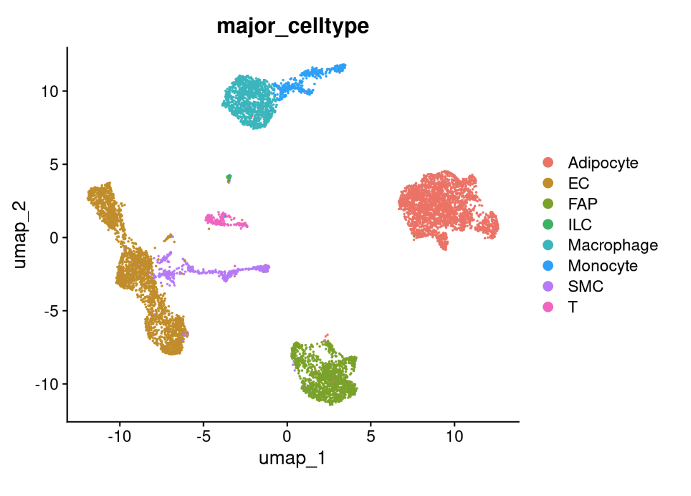

# Normalization, clustering and annotation 
Gene-expression values were normalized using sctransform (v2). Principal component analysis (PCA) was carried out using the variable features for the SCT Assay Uniform Manifold Approximation and Projection (UMAP) analysis was performed to further reduce variation to two dimensions with ‘RunUMAP’ function with 25 to 40 principal components, and a resolution range from 0.6 to 2. These clusters were manually annotated based on differentially expressed genes generated from ‘FindAllMarkers’ function as well as the canonical marker genes from published literature. 

## Standard pre-processing workflow by applying sctransform normalization
The sctransform function in Seurat consolidates the functionality of NormalizeData(), ScaleData(), and FindVariableFeatures() into a single command. The transformed data is stored in the SCT assay, which is set as the default assay after running sctransform.

During normalization, it is possible to regress out confounding sources of variation, such as the percentage of mitochondrial reads. In Seurat v5, SCT v2 is applied by default, though you can revert to v1 by setting vst.flavor = 'v1'. Additionally, the glmGamPoi package, which significantly enhances processing speed, is used by default if installed. You can find installation instructions here.

In the same time, we perform dimensional reduction and genarates an 'Elbow plot' to find the majority of true signal captured in each PCs
```{shell}
cohort_1 <- SCTransform(cohort_1, vars.to.regress = "percent.mt", verbose = FALSE) %>%
   RunPCA(npcs = 75, verbose = FALSE)
ElbowPlot(cohort_1, ndims = 50)
```
```{r, echo=FALSE}
knitr::include_graphics("image/elbow.png")
```

To cluster the cells, we apply modularity optimization techniques, such as the Louvain algorithm (default), which iteratively group cells with the goal of optimizing the standard modularity function. The FindClusters() function in Seurat implements this procedure and includes a resolution parameter that controls the 'granularity' of clustering. Higher resolution values result in a greater number of clusters, providing finer distinctions between cell groups.
```{shell}
cohort_1 <- RunUMAP(cohort_1, reduction = "pca", dims = 1:40, verbose = FALSE) %>%
  FindNeighbors(reduction = "pca", dims = 1:40, verbose = FALSE) %>%
  FindClusters(resolution = 0.6, verbose = FALSE)
DimPlot(cohort_1, label = T, repel = T) 
```

```{r, echo=FALSE}
knitr::include_graphics("image/umap.png")
```

## Assigning cell type identity to clusters
Fortunately in the case of the adipose tissue dataset, we can use canonical markers to easily match the unbiased clustering to known cell types:
```{shell}
genes_to_check <- c ("CD3D", "CD3E", "PTPRC", "CD4", 
                     "CD2", "CD40LG", "IL7R", #Naive CD4 T
                     "KLRF1", "PRF1", "GZMB", "KLRD1",#Cytotoxic CD8 T
                     "CD8A", "GZMH", "NKG7", #Naive CD8 T
                     "CLTA4", "TIGIT", "FOXP3", #Treg
                     "CCR6", "KLRB1", "CEBPD", #MAIT
                     "LEF1", "KLRC2", "ZNF683", #CD8 gd T
                     "GZMK", "CCL5", "XCL2", "CCL4", #NK-like
                     "CX3CR1", "FCG3RA", "GNLY", "SPON2", #mNK
                     "KIT", "CD200R1", "TPBC2",  #ILCs
                     "FPR2", "SMIM25", #ncMo
                     "S100A9", "MMP19", #Monocyte
                     "S100A8", "EREG", "IL1B", #myeloid-like
                     "XCR1", "CLEC9A", "CADM1", #cDC1
                     "CLEC10A", "CD1C", "FCER1A", #cDC2B
                     "IGKC", "CD79A", "IEBF1", #B cell
                     "C1QA", "RNASE1", "LYE1", # PVMs
                     "MRC1", "C1QB", "CD86", #Macrophage
                     "DKK1", "PI16", "PRG4", "DPP4","PDGFRA", #APC
                     "RGS5","MYH11", #SMC & Pericyte
                     "CLDN5", "VWF", "PECAM1", #Endothelial
                     "PLIN1","PLIN4","ADIPOQ") #Adipocyte

DotPlot(cohort_1, features = genes_to_check,  
        cols = c("gray95", "red"), cluster.idents = T, col.min = 0, 
        assay='SCT') + coord_flip()
```

```{r, echo=FALSE}
knitr::include_graphics("image/dotplot.png")
```


```{shell}
cohort_1@meta.data$major_celltype[cohort_1@meta.data$seurat_clusters %in% c(0,10,12)] <- 'Adipocyte'
cohort_1@meta.data$major_celltype[cohort_1@meta.data$seurat_clusters %in% c(8,9)] <- 'SMC'
cohort_1@meta.data$major_celltype[cohort_1@meta.data$seurat_clusters %in% 1] <- 'Macrophage'
cohort_1@meta.data$major_celltype[cohort_1@meta.data$seurat_clusters %in% c(2,7)] <- 'FAP'
cohort_1@meta.data$major_celltype[cohort_1@meta.data$seurat_clusters %in% 11] <- 'T'
cohort_1@meta.data$major_celltype[cohort_1@meta.data$seurat_clusters %in% c(3,4,5,13)] <- 'EC'
cohort_1@meta.data$major_celltype[cohort_1@meta.data$seurat_clusters %in% 6] <- 'Monocyte'
cohort_1@meta.data$major_celltype[cohort_1@meta.data$seurat_clusters %in% 14] <- 'ILC'
DimPlot(cohort_1, group.by = 'major_celltype')
```

```{r, echo=FALSE}

```

## Save the object
```{shell}
saveRDS(cohort_1, file = './data/DemoSingle/Cohort_1_demo_annotated.rds')
```

