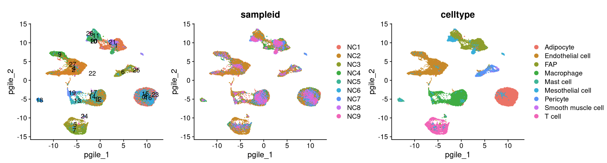
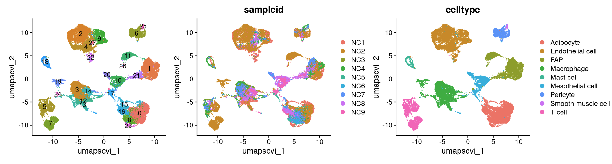

# Data integration 
After filtering, mitochondrial, ribosomal protein-coding and leukocyte antigen genes were removed from these 5 datasets. Batch effect were corrected by applying following integration tools: CCA and RPCA performed in the ‘IntegrateLayers’ function which is a streamlined integrative analysis from Seurat, Harmony as well as scVI(version 1.1.2). We used all genes in scVI integration, and Seurat objects were transcribed into anndata objects using scfetch (version 0.5.0) in R with reticulate (1.37.0).


The integration of single-cell sequencing datasets—such as those from different experimental batches, donors, or conditions—is often a critical step in scRNA-seq workflows. Integrative analysis helps align shared cell types and states across datasets, enhancing statistical power and, more importantly, enabling accurate comparative analysis. In previous versions of Seurat, we introduced anchor-based integration methods to facilitate this process. Additionally, several labs have developed innovative tools for integration, including Harmony and scVI, which have proven to be powerful methods for scRNA-seq analysis. For more information, please refer to our vignette on integrating scRNA-seq data using multiple tools.

## Library all the packages
```{shell}
library(reticulate)
library(scfetch)
library(Seurat)
library(SeuratData)
library(harmony)
library(dplyr)
library(patchwork)
library(sctransform)
library(ggplot2)
```


## Load all the objects used for batch-effect correction
```{shell}
cohort_1 <- readRDS('./data/DemoIntegrated/cohort_1_s.rds')
cohort_2_s_1 <- readRDS('./data/DemoIntegrated/cohort_2_s_1_s.rds')
cohort_2_s_2 <- readRDS('./data/DemoIntegrated/cohort_2_s_2_s.rds')
cohort_3 <- readRDS('./data/DemoIntegrated/cohort_3_s.rds')
cohort_4_o_1 <- readRDS('./data/DemoIntegrated/cohort_4_o_1_s.rds')
cohort_4_o_2 <- readRDS('./data/DemoIntegrated/cohort_4_o_2_s.rds')
cohort_4_o_3 <- readRDS('./data/DemoIntegrated/cohort_4_o_3_s.rds')
cohort_4_o_4 <- readRDS('./data/DemoIntegrated/cohort_4_o_4_s.rds')
cohort_4_o_5 <- readRDS('./data/DemoIntegrated/cohort_4_o_5_s.rds')
```


## Pre-processing before data integration
Add Donor ID as batch information
```{shell}
cohort_1@meta.data$sampleid <- 'ID1'
cohort_3@meta.data$sampleid <- 'ID2'
cohort_2_s_1@meta.data$sampleid <- 'ID3'
cohort_2_s_2@meta.data$sampleid <- 'ID4'
cohort_4_o_1@meta.data$sampleid <- 'ID5'
cohort_4_o_2@meta.data$sampleid <- 'ID6'
cohort_4_o_3@meta.data$sampleid <- 'ID7'
cohort_4_o_4@meta.data$sampleid <- 'ID8'
cohort_4_o_5@meta.data$sampleid <- 'ID9'
```


Create a object which contains multiple 'layers' to help to integrate all samples together, so that we can jointly identify cell subpopulations across datasets, and then explore how each group differs across conditions.
```{shell}
NC_list <- list(cohort_1, cohort_2_s_1, cohort_2_s_2, cohort_3,
                cohort_4_o_1, cohort_4_o_2, cohort_4_o_3, cohort_4_o_4, cohort_4_o_5)

for (i in 1:length(NC_list)) {
  DefaultAssay(NC_list[[i]]) <- 'RNA'
  NC_list[[i]] <- SCTransform(NC_list[[i]], vars.to.regress = "percent.mt", verbose = FALSE)
}

NC_merged <- merge(x = NC_list[[1]],
                     y = NC_list[2:length(NC_list)])
```


In order to better identify the cell types, we plan to remove MT-/RP-/HLA- related genes before integration
```{shell}
gene_mt <- rownames(NC_merged)[grep("^MT-", rownames(NC_merged))]
gene_rb <- rownames(NC_merged)[grep("^RP[SL]", rownames(NC_merged))]
gene_hla <- rownames(NC_merged)[grep("^HLA-", rownames(NC_merged))]

gene_rb <- as.data.frame(gene_rb)
gene_hla <- as.data.frame(gene_hla)
gene_mt <- as.data.frame(gene_mt)
gene <- rownames(NC_merged)
gene <- as.data.frame(gene)

gene$type <- gene$gene %in% gene_rb$gene_rb
gene <- gene[gene$type == "FALSE",]

gene$type <- gene$gene %in% gene_hla$gene_hla
gene <- gene[gene$type == "FALSE",]

gene$type <- gene$gene %in% gene_mt$gene_mt
gene <- gene[gene$type == "FALSE",]
gene_list <- gene$gene

for (i in 1: length(NC_list)) {
  DefaultAssay(NC_list[[i]]) <- 'RNA'
  counts <- GetAssayData(NC_list[[i]], layer = 'counts')
  counts <- counts[rownames(counts) %in% gene_list, ]
  meta.data <- NC_list[[i]]@meta.data
  NC_list[[i]] <- CreateSeuratObject(counts = counts,
                                       meta.data = meta.data)
  
  NC_list[[i]] <- SCTransform(NC_list[[i]], vars.to.regress = "percent.mt", verbose = FALSE)
}

NC_merged <- merge(NC_list[[1]], 
                     y = NC_list[2:length(NC_list)],
                     merge.data = TRUE)
NC_merged
```


## Peform analysis without integration
We begin by analyzing the dataset without performing integration to assess whether batch-effect correction is necessary. The resulting clusters are defined by both cell type and stimulation condition, which poses challenges for downstream analysis.
```{shell}
DefaultAssay(NC_merged) <- 'SCT'

NC_merged <- SCTransform(NC_merged, verbose = T) 

NC_merged <- RunPCA(NC_merged, npcs = 100, verbose = T)
ElbowPlot(NC_merged, ndims = 50)

NC_merged <- RunUMAP(NC_merged, dims = 1:30, reduction = "pca", reduction.name = "unintegrated")

DimPlot(NC_merged, reduction = "unintegrated", group.by = "sampleid")
```

```{r, echo=FALSE}
knitr::include_graphics("image/unintegrated.png")
```

## Perform integration
We now aim to integrate data from all the donors, so that cells from the same cell type/subpopulation will cluster together.For data integration, our goal is not to remove biological differences across conditions or different batches, but to learn shared cell types/states in an initial step - specifically because that will enable us to compare control stimulated and control profiles for these individual cell types.

Seurat v5 supports a more streamlined integrated analysis through the use of the IntegrateLayers function. The current method supports five integration methods. Each of these methods performs integration in a low-dimensional space and returns a dimensionality reduction (i.e. integrated.rpca) designed to embed shared unit types across batches, here we use three of them:

1. Anchor-based CCA integration (method=CCAIntegration)

2. Anchor-based RPCA integration (method=RPCAIntegration)

3. Harmony (method=HarmonyIntegration)

### Anchor-based CCA integration

The Seurat v5 integration procedure aims to return a single dimensional reduction that captures the shared sources of variance across multiple layers, so that cells in a similar biological state will cluster. The method returns a dimensional reduction (i.e. integrated.cca) which can be used for visualization and unsupervised clustering analysis. For evaluating performance, we can use cell type labels that are pre-loaded in the seurat_annotations metadata column.
```{shell}
NC_merged <- IntegrateLayers(
  object = NC_merged, method = CCAIntegration,
  normalization.method = "SCT", 
  verbose = FALSE)

NC_merged <- FindNeighbors(NC_merged, reduction = "integrated.dr", dims = 1:30, verbose = FALSE)
NC_merged <- FindClusters(NC_merged, verbose = FALSE)
NC_merged <- RunUMAP(NC_merged, reduction = "integrated.dr", dims = 1:30, reduction.name = "cca", verbose = FALSE)
```

### Anchor-based RPCA integration
```{shell}
NC_merged <- IntegrateLayers(
  object = NC_merged, method = RPCAIntegration,
  normalization.method = "SCT", 
  new.reduction = "integrated.rpca",
  verbose = FALSE)

NC_merged <- FindNeighbors(NC_merged, reduction = "integrated.rpca", dims = 1:30, verbose = FALSE)
NC_merged <- FindClusters(NC_merged, verbose = FALSE)
NC_merged <- RunUMAP(NC_merged, reduction = "integrated.rpca", dims = 1:30, reduction.name = "rpca", verbose = FALSE)
```

### Harmony
```{shell}
NC_merged <- IntegrateLayers(
  object = NC_merged, method = HarmonyIntegration,
  normalization.method = "SCT", 
  new.reduction = "integrated.harmony",
  verbose = FALSE)

NC_merged <- FindNeighbors(NC_merged, reduction = "integrated.harmony", dims = 1:30, verbose = FALSE)
NC_merged <- FindClusters(NC_merged, verbose = FALSE)
NC_merged <- RunUMAP(NC_merged, reduction = "integrated.harmony", dims = 1:30, reduction.name = "harmony", verbose = FALSE)
```


### scVI
scvi-tools (single-cell variational inference tools) is a package for probabilistic modeling of single-cell omics data, built on top of PyTorch and AnnData. The package hosts implementations of several models that perform a wide range of single-cell data analysis tasks, as well as the building blocks to rapidly prototype new probabilistic models.

For using scVI in R, scVI integration requires installing reticulate and scfetch as well as scvi-tools and its depencies in its environment. You can find the detailed instructions on the documentation:
https://scvi-tools.org/get_started/
```{shell}
use_condaenv("~/miniconda3/envs/scvi", required=T)
sc <- import("scanpy", convert = FALSE)
scvi <- import("scvi", convert = FALSE)

# prepare an anndata
NC_merged@assays$SCT@data <- NC_merged@assays$SCT@counts
dim(NC_merged@assays$SCT@data)
ExportSeurat(seu.obj = NC_merged, assay = "SCT", to = "AnnData",
             conda.path = "~/miniconda3/envs/scvi",
             anndata.file = "./data/DemoIntegrated/merged.h5ad")

adata <- sc$read('./data/DemoIntegrated/merged.h5ad')

# run setup_anndata
scvi$model$SCVI$setup_anndata(adata, batch_key = 'sampleid') 
model = scvi$model$SCVI(adata)

# train the model
model$train()
#  get the latent represention
latent = model$get_latent_representation()

# put it back in the original Seurat object
latent <- as.matrix(latent)
rownames(latent) = colnames(NC_merged)
NC_merged[["integrated.scvi"]] <- CreateDimReducObject(embeddings = latent, key = "scvi_", assay = DefaultAssay(NC_merged))

NC_merged <- FindNeighbors(NC_merged, reduction = "integrated.scvi", dims = 1:10, verbose = FALSE)
NC_merged <- FindClusters(NC_merged, resolution = 0.6, verbose = FALSE)

NC_merged <- RunUMAP(NC_merged, dims = 1:10, reduction = 'integrated.scvi', reduction.name = 'scvi', verbose = FALSE)
```

### scANVI
```{shell}
# run setup_anndata
model = scvi$model$SCANVI(adata)

# train the model
model$train()
#  get the latent represention
latent = model$get_latent_representation()

# put it back in the original Seurat object
latent <- as.matrix(latent)
rownames(latent) = colnames(NC_merged)
NC_merged[["integrated.scanvi"]] <- CreateDimReducObject(embeddings = latent, key = "scanvi_", assay = DefaultAssay(NC_merged))

NC_merged <- FindNeighbors(NC_merged, reduction = "integrated.scanvi", dims = 1:10, verbose = FALSE)
NC_merged <- FindClusters(NC_merged, resolution = 0.6, verbose = FALSE)

NC_merged <- RunUMAP(NC_merged, dims = 1:10, reduction = 'integrated.scanvi', reduction.name = 'scanvi', verbose = FALSE)
```


## Visualition
```{shell}
reduction_name <- c('unintegrated','rpca','cca','harmony','scvi','scanvi')
for (i in 1:length(reduction_name)) {
  a <- DimPlot(NC_merged, reduction = reduction_name[i], label = TRUE) + NoLegend()
  b <- DimPlot(NC_merged, reduction = reduction_name[i], group.by = "sampleid")
  c <- DimPlot(NC_merged, reduction = reduction_name[i], group.by = "celltype")
  
  print(a+b+c)
}

```


```{r, echo=FALSE}
knitr::include_graphics("image/unintegrated_a.png")
knitr::include_graphics("image/cca.png")
knitr::include_graphics("image/rpca.png")


knitr::include_graphics("image/scanvi.png")


sessionInfo()
```
